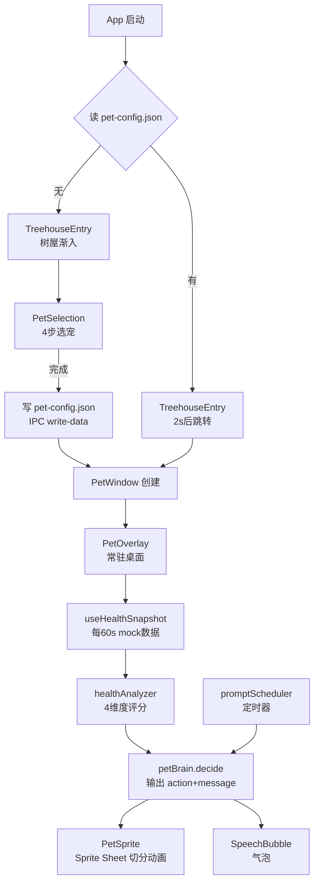

# Health Buddy — Phase 1 开发计划

## 数据流总览




---

## TASK 01 — 项目脚手架

**目标文件**：`package.json`, `tsconfig.json`, `vite.config.ts`, `index.html`, `src/main.tsx`, `src/App.tsx`, `src/index.css`

- 在工作区根目录用 `electron-vite` 初始化（React + TypeScript 模板）
- 安装依赖：`framer-motion`, `zustand`, `react-router-dom`，开发依赖：`tailwindcss`, `postcss`, `autoprefixer`
- `vite.config.ts` 中设置 `publicDir: path.resolve(__dirname, 'assetstore')`
- 配置 Tailwind，在 `src/index.css` 中引入三条 Tailwind 指令
- `src/App.tsx` 使用 `MemoryRouter` 定义三条路由：`/`、`/select-pet`、`/pet-overlay`

---

## TASK 02 — IPC 类型 + Electron 主进程骨架

**目标文件**：`electron/ipc/types.ts`, `electron/preload.ts`, `electron/main.ts`

### `electron/ipc/types.ts`

定义所有 IPC 事件名枚举和 payload 类型（`window-move`, `pet-config-save`, `get-health-data`, `read-data`, `write-data`, `pet-action-trigger`, `show-speech-bubble`, `add-water-record`, `add-steps`）

### `electron/preload.ts`

通过 `contextBridge` 暴露：

```typescript
window.electronAPI = {
  readData: (filename) => ipcRenderer.invoke('read-data', filename),
  writeData: (filename, data) => ipcRenderer.invoke('write-data', filename, data),
  windowMove: (delta) => ipcRenderer.send('window-move', delta),
  onPetAction: (cb) => ipcRenderer.on('pet-action-trigger', cb),
  onSpeechBubble: (cb) => ipcRenderer.on('show-speech-bubble', cb),
}
```

### `electron/main.ts`

- `createTreehouseWindow()`：960×640，无边框，深色背景，加载 `/`
- `createPetWindow()`：200×240，透明，alwaysOnTop，加载 `/pet-overlay`
- `registerIpcHandlers()`：注册 `read-data`/`write-data`（fs 读写 `assetstore/data/`），`window-move`（增量移窗），`pet-config-save`（写入后创建 PetWindow）
- 系统托盘：显示/隐藏宠物、手动记录饮水/步数、退出

---

## TASK 03 — 类型定义 + Store

**目标文件**：`src/store/petStore.ts`, `src/store/healthStore.ts`

### `src/store/petStore.ts`

```typescript
// Zustand，运行时存内存；持久化通过 IPC 写文件
interface PetState {
  config: PetConfig | null
  currentAction: PetAction
  isOnboarded: boolean
  setConfig(c: PetConfig): void
  setAction(a: PetAction): void
  completeOnboarding(): void
}
```

启动时调用 `window.electronAPI.readData('pet-config.json')` 恢复配置

### `src/store/healthStore.ts`

```typescript
interface HealthStore {
  raw: RawHealthData | null
  state: HealthState | null
  setRaw(d: RawHealthData): void
  setState(s: HealthState): void
}
```

全部共享类型（`PetConfig`, `RawHealthData`, `HealthState`, `PetAction`, `BrainOutput`, `SpriteSheetDef`）定义在 `src/store/types.ts`

---

## TASK 04 — 精灵图配置 + PetSprite 组件

**目标文件**：`src/engine/spriteConfig.ts`, `src/components/PetSprite.tsx`

### `src/engine/spriteConfig.ts`

开发启动前，用图片查看器量出 4 张图的实际帧数，填入：

```typescript
export const SPRITE_CONFIG: Record<PetAction, SpriteSheetDef> = {
  idle:    { file: 'pets/birds/gentle/usual.png',  cols: ?, fps: 8  },
  happy:   { file: 'pets/birds/gentle/usual.png',  cols: ?, fps: 10 },
  talk:    { file: 'pets/birds/gentle/chat.png',   cols: ?, fps: 10 },
  yawn:    { file: 'pets/birds/gentle/tired.png',  cols: ?, fps: 6  },
  sleep:   { file: 'pets/birds/gentle/tired.png',  cols: ?, fps: 5  },
  worried: { file: 'pets/birds/gentle/prompt.png', cols: ?, fps: 8  },
  stretch: { file: 'pets/birds/gentle/prompt.png', cols: ?, fps: 8  },
}
```

### `src/components/PetSprite.tsx`

核心逻辑（改造自 `垃圾/health_buddy/apps/web/src/components/PetSprite.tsx`）：

- 根据 `action` prop 查 `SPRITE_CONFIG` 得到 `{file, cols, fps}`
- 用 `new Image()` 加载 Sheet，`onload` 后开始 rAF 循环
- action 切换时：重新加载 Sheet（如果文件变了）+ 重置 `frameIndex = 0`
- Canvas `drawImage` 切分：`sx = frameIndex * (img.naturalWidth / cols)`

---

## TASK 05 — SpeechBubble 组件

**目标文件**：`src/components/SpeechBubble.tsx`

直接复用 `垃圾/health_buddy/apps/web/src/components/SpeechBubble.tsx`，调整：

- Props：`{ text: string; visible: boolean; onDismiss?: () => void }`
- Framer Motion：`initial={{ scale: 0.5, opacity: 0 }}`，`animate={{ scale: 1, opacity: 1 }}`
- 4s 后自动调用 `onDismiss`（通过 `useEffect` + `setTimeout`）
- 气泡尾巴朝下，定位在宠物上方

---

## TASK 06 — Engine 层（分析 + 决策）

**目标文件**：`src/engine/healthAnalyzer.ts`, `src/engine/behaviorMapping.ts`, `src/engine/dialogLibrary.ts`, `src/engine/stateMachine.ts`, `src/engine/petBrain.ts`

### `healthAnalyzer.ts`：`RawHealthData → HealthState`

```typescript
export function analyzeHealth(raw: RawHealthData): HealthState {
  const energy = Math.max(0, 100 - fatigueScore(raw))
  const stress = stressScore(raw)
  const burnout = burnoutScore(raw)
  const sedentary = Math.min(100, raw.sedentaryMinutes * 100 / 120)
  const hydrationDue = raw.waterCups < Math.floor(Date.now() / 7200000) % 8
  const sleepDue = new Date().getHours() >= 23 || new Date().getHours() < 6
  return { energy, stress, burnout, sedentary, hydrationDue, sleepDue, timestamp: Date.now() }
}
```

### `behaviorMapping.ts`：`HealthState → PetAction`（优先级规则）

### `dialogLibrary.ts`：从旧版 `petBehaviorMapping.ts` 搬运台词库，映射到4种性格

### `stateMachine.ts`：管理状态转换，防止频繁抖动（同一状态至少持续30s）

### `petBrain.ts`：串联以上模块，输出 `BrainOutput`

---

## TASK 07 — Mock 数据 + Hooks

**目标文件**：`src/mock/mockHealthData.ts`, `src/hooks/useHealthSnapshot.ts`, `src/hooks/usePetBrain.ts`

### `src/mock/mockHealthData.ts`

基于旧版数据，补全 `RawHealthData` 所有字段（sedentaryMinutes 设为 97 触发 stretch 提示）

### `src/hooks/useHealthSnapshot.ts`

Phase 1：每60s 返回 mock 数据，写入 healthStore，同时通过 IPC 持久化到 `health-today.json`

### `src/hooks/usePetBrain.ts`

监听 healthStore 变化 → 调用 `petBrain.decide()` → 更新 petStore.action + 触发气泡显示

---

## TASK 08 — TreehouseEntry 页面

**目标文件**：`src/pages/TreehouseEntry/index.tsx`

- 全屏暗色背景（`#0d0d1a`）
- `` 用 Framer Motion 淡入（duration 1.2s，delay 0.3s）
- 启动时读 `pet-config.json`；若有 → 2s 后 `navigate('/pet-overlay')` 并通知 main 创建 PetWindow；若无 → 点击画面 `navigate('/select-pet')`
- 底部小字提示："点击任意位置开始" / "欢迎回来"

---

## TASK 09 — PetSelection 页面

**目标文件**：`src/pages/PetSelection/index.tsx`

改造自 `垃圾/health_buddy/apps/web/src/pages/PetSelection/index.tsx`：

- 4步向导：种类（麻雀/玄凤/伯劳/雨燕）→ 毛色+性别 → 性格（4种）→ 命名
- 顶部进度条（step/4）
- 右侧常驻 `PetSprite` 预览（action='idle'，size=130）
- 完成后：调 `petStore.setConfig()`，IPC `write-data('pet-config.json', config)`，IPC `pet-config-save` 通知 main 创建 PetWindow，TreehouseWindow 关闭

---

## TASK 10 — PetOverlay 页面

**目标文件**：`src/pages/PetOverlay/index.tsx`

- 整个窗口透明，只有宠物和气泡可见
- `usePetBrain()` hook 在此页面激活，驱动 action + message
- `useHealthSnapshot()` 在此页面启动定时器
- 鼠标按下时记录起始位置，`mousemove` 发送 IPC `window-move`
- 点击宠物 → 触发互动台词（`getInteractionMessage(personality)`）→ 显示 SpeechBubble
- `promptScheduler` 在此初始化（定时检查并触发提醒气泡）
- 右键菜单（原生 Electron ContextMenu）：显示当前健康数据摘要 / 退出

---

## TASK 11 — promptScheduler

**目标文件**：`src/features/health-prompt/promptScheduler.ts`

```typescript
// 在 PetOverlay 挂载时 start()，卸载时 stop()
export function usePromptScheduler() {
  useEffect(() => {
    const timer = setInterval(() => {
      const state = useHealthStore.getState().state
      if (!state) return
      const output = petBrain.decide(state, config)
      if (output.message) triggerBubble(output.message)
    }, 60_000)
    return () => clearInterval(timer)
  }, [])
}
```

---

## TASK 12 — 联调 + 资产验证

- 量出4张精灵图实际 cols，填入 `spriteConfig.ts`
- 创建 `assetstore/data/` 目录（供 IPC 读写）
- `npm run dev` 验证全流程：启动 → 树屋渐入 → 选宠 → 悬浮宠物动画 → 60s 后健康提醒气泡

---

## 关键依赖版本

```json
{
  "electron": "^28.x",
  "electron-vite": "^2.x",
  "react": "^18.x",
  "framer-motion": "^11.x",
  "zustand": "^4.x",
  "react-router-dom": "^6.x",
  "tailwindcss": "^3.x"
}
```

## 文件复用来源

- `PetSprite.tsx` 核心逻辑 ← `垃圾/health_buddy/apps/web/src/components/PetSprite.tsx`（改造切分方式）
- `SpeechBubble.tsx` ← `垃圾/health_buddy/apps/web/src/components/SpeechBubble.tsx`（直接复用）
- 台词库 ← `垃圾/health_buddy/apps/web/src/mock/petBehaviorMapping.ts`（搬运到 dialogLibrary.ts）
- Electron 主进程结构 ← `垃圾/health_buddy/apps/desktop-pet/src/main.ts`（简化 + 新增 fs IPC）
- PetSelection 布局 ← `垃圾/health_buddy/apps/web/src/pages/PetSelection/index.tsx`（改性格选项）


注意一个点：不要引用垃圾文件夹之中的内容，如有需要，把它拷贝到相应的位置。（事后垃圾文件夹会删除）